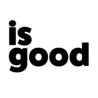

<!--
*** The isgood.ai ReadME is based on ->
*** Thanks for checking out the Best-README-Template. If you have a suggestion
*** that would make this better, please fork the repo and create a pull request
*** or simply open an issue with the tag "enhancement".
*** Don't forget to give the project a star!
*** Thanks again! Now go create something AMAZING! :D
-->

<!-- PROJECT LOGO -->
 

  

<h3 align="center">isgood.ai WebSite</h3>

  

    🎉 New isgood Website (re-)build for 2022 Launch 🚀 - built on Drupal
     
    <a href="https://docs.isgood.ai"><strong>Explore the docs »</strong></a>
     
     
    <a href="https://isgood.ai">View Site</a>
    ·
    <a href="https://github.com/for-good/d-site-isgood/issues/new?assignees=&labels=&template=bug_report.md&title=">Report Bug</a>
    ·
    <a href="https://github.com/for-good/d-site-isgood/issues/new?assignees=&labels=&template=feature_request.md&title=">Request Feature</a>
  

<!-- TABLE OF CONTENTS -->

  
Table of Contents

  <ol>
    <li>
      <a href="#about-the-project">About The Project</a>
    </li>
    <li>
      <a href="#getting-started">Getting Started</a>
<!--      <ul>
        <li><a href="#prerequisites">Prerequisites</a></li>
        <li><a href="#installation">Installation</a></li>
      </ul> -->
    </li>
<!--    <li><a href="#usage">Usage</a></li> -->
    <li><a href="#roadmap">Dev Roadmap</a></li>
    <li><a href="#contributing">Contributing</a></li>
    <li><a href="#license">License</a></li>
    <li><a href="#contact">Contact</a></li>
    <li><a href="#acknowledgments">Acknowledgments</a>
      <ul>
        <li><a href="#built-with">Built With</a></li>
      </ul>
    </li>
  </ol>

<!-- ABOUT THE PROJECT -->
## About The Project

[![Product Name Screen Shot][product-screenshot]](.github/images/isgood-github-grab.png)

<!-- GETTING STARTED -->
## Getting Started

- If contribnuting via code, please see our docs for the latest info @[docs.isgood.ai](https://docs.isgood.ai/)
- If wishing to be part of our content, comms and website build team, reach out via the (<a href="#contacts">contact details listed below</a>).

(<a href="#top">back to top</a>)

<!-- USAGE EXAMPLES
## Usage

Use this space to show useful examples of how a project can be used. Additional screenshots, code examples and demos work well in this space. You may also link to more resources.

_For more examples, please refer to the [Documentation](https://example.com)_

(<a href="#top">back to top</a>)

 -->

<!-- ROADMAP -->
## Roadmap

We `build in public`, but **the tasks for the website build and content is managed via Notion**.
Please reachout for more info or to get involved via the (<a href="#contacts">contact details listed below</a>).

Any issues raised via github are viewable at [open issues](https://github.com/for-good/d-site-isgood/issues).

<!-- CONTRIBUTING -->
## Contributing

We've had hundreds of contributors and partners over ~7 years of R&D and in market POCs; and, now we're delivering on all of that work and making it accessible through a WebApp.This repo is for the website, through which we'll be able to provide the support and information for others to useour platforms and tools to create good in the world.

As an open source project, we LOVE contributions.  We have some info to get started in our [Contributors Guide »](https://docs.isgood.ai/welcome/contributing)

You can also simply [open an issue](https://github.com/for-good/d-site-isgood/issues/new/choose), or [discuss stuff with us directly](https://github.com/for-good/d-site-isgood/discussions).

We'd also love for you to join us at a community event (starting again soon) or through any of our social media to chat about how you can contribute to isgood!

<!-- PROJECT SHIELDS -->
<!--
*** I'm using markdown "reference style" links for readability.
*** Reference links are enclosed in brackets [ ] instead of parentheses ( ).
*** See the bottom of this document for the declaration of the reference variables
*** for contributors-url, forks-url, etc. This is an optional, concise syntax you may use.
*** https://www.markdownguide.org/basic-syntax/#reference-style-links
-->
[![Contributors][contributors-shield]][contributors-url]
[![Forks][forks-shield]][forks-url]
[![Stargazers][stars-shield]][stars-url]
[![Issues][issues-shield]][issues-url]
[![MIT License][license-shield]][license-url]

(<a href="#top">back to top</a>)

<!-- CONTACT -->
## Contacts

[![LinkedIn][linkedin-shield]][linkedin-url]
[![Email][email-shield]][email-url]

Courtney McConnochie - [Connect on LinkedIn](https://www.linkedin.com/in/courtney-mcconnochie/)

Max Lynam - [Connect on LinkedIn](https://www.linkedin.com/in/maxlynam/)
Project Site: [https://isgood.ai](https://isgood.ai)

(<a href="#top">back to top</a>)

<!-- LICENSE -->
## License

Distributed under the GPL3.0 License. See `LICENSE.txt` for more information.

(<a href="#top">back to top</a>)

<!-- ACKNOWLEDGMENTS -->
## Acknowledgments

Current Dev & Tech Sponsors
* [Amazee+Lagoon: Host & DevOps Sponsor](https://www.amazee.io/)
* [Github: GitOps Sponsor](https://github.com)
* [AWS: CloudInfra Sponsor](https://aws.amazon.com/)
* [Gitbook: Docs Sponsor](https://gitbook.com)

(<a href="#top">back to top</a>)

### Built With

Initial starter services:
* Lagoon
* Drupal 9.2
* PHP 8.0
* NGINX
* Postgres 11

(<a href="#top">back to top</a>)

<!-- MARKDOWN LINKS & IMAGES -->
<!-- https://www.markdownguide.org/basic-syntax/#reference-style-links -->
[contributors-shield]: https://img.shields.io/github/contributors/for-good/d-site-isgood.svg?style=for-the-badge
[contributors-url]: https://github.com/for-good/d-site-isgood/graphs/contributors
[forks-shield]: https://img.shields.io/github/forks/for-good/d-site-isgood.svg?style=for-the-badge
[forks-url]: https://github.com/for-good/d-site-isgood/network/members
[stars-shield]: https://img.shields.io/github/stars/for-good/d-site-isgood.svg?style=for-the-badge
[stars-url]: https://github.com/for-good/d-site-isgood/stargazers
[issues-shield]: https://img.shields.io/github/issues/for-good/d-site-isgood.svg?style=for-the-badge
[issues-url]: https://github.com/for-good/d-site-isgood/issues
[license-shield]: https://img.shields.io/github/license/for-good/d-site-isgood.svg?style=for-the-badge
[license-url]: https://github.com/for-good/d-site-isgood/blob/master/LICENSE.txt
[linkedin-shield]: https://img.shields.io/badge/linkedin-%230077B5.svg?style=for-the-badge&logo=linkedin&logoColor=white
[linkedin-url]: https://www.linkedin.com/company/isgoodai/
[email-shield]: https://img.shields.io/badge/Gmail-D14836?style=for-the-badge&logo=gmail&logoColor=white
[email-url]: support@isgood.ai
[product-screenshot]: .github/images/isgood-github-grab.png